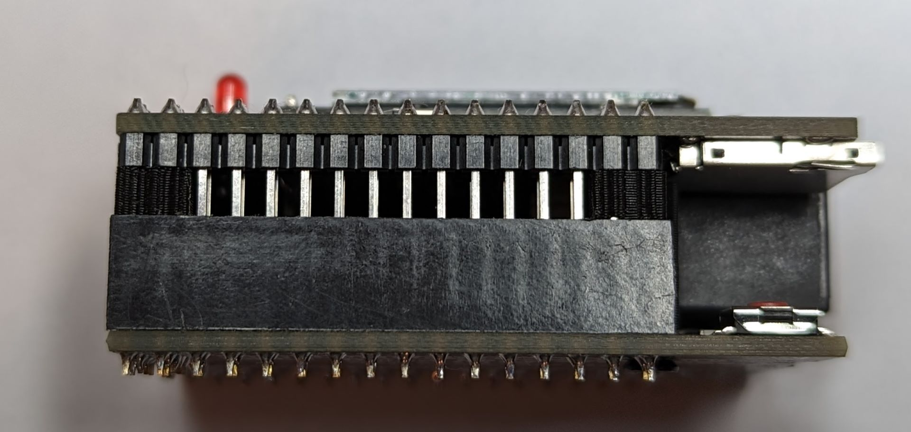

# Coleco Adam ADE Pro Mini OLED Edition

Yet another version of hardware compatible with the [AdamNet Drive Emulator](https://github.com/Kalidomra/AdamNet-Drive-Emulator) (ADE) software by Sean Myers. This is a smaller version of my [previous design](https://github.com/djtersteegc/coleco-adam-ade-pro-shield) now built around an (unofficial) Aruduino Mega 2560 PRO Embed board and replacing the 1602 LCD with an 0.91" I2C OLED screen and SMD components.

Here's a size comparison between the two versions.

All components can be sourced from the usual low cost China based vendors for a total build cost of around $20.  Please see the hardware component page for more details.

[Hardware Component Choices](https://djtersteegc.github.io/coleco-adam-ade-pro-embed-shield/components.html)

An interactive BOM and parts placement diagram is also available.

[Interactive Bill of Materials (BOM)](https://djtersteegc.github.io/coleco-adam-ade-pro-embed-shield/ibom.html)

# Assembley

Even though this is mostly SMD, assembley is pretty easy since everything is 0805 sized or bigger, but you do need to follow a certain order since some components overlap each other or become difficult to reach. Start by doing all the SMD components (resistors, caps, IC, transistor, and SD card socket) on the underside of the board. I used solder paste and hot air, but you could also hand solder these. Pay attention to the orientaion of the two polarized caps if you elect to install them.

Then flip the boad over and install the switches.  For this I used solder paste and a hand iron.

Next install the RJ12 jack.

I soldered the headers on next, but you could also the do the OLED and LED if you don't want to seperate the boards again after soldering the headers on.  I tend to do the OLED last just to minimize the chance of breaking it.  For the LED I placed the top half of the board in the case and used a 1mm spacer under the case top of get a nice reveal and then soldered it in. For the OLED I installed in on 3mm thick double sided foam tape and then soldered the headers on once I confirmed it was straight.  

For the headers I like to screw in the two 14.6mm spacers and assemble the two halves to make sure everything stays aligned.  Use M2.5x6mm (or longer) screws for the spacers.  The one with the cut on the top goes in the hole by the SD card with the cut out area facing the SD card socket.

After everything is soldered I then inserted four of the 3.6mm header block spacers in all four corners to ensure everything stayed leveled and the male header pin aren't pushed to far into the female headers.

# Programming

This version does require updates to Sean's original ADE code base to support the OLED screen and remaps a number of pins to support this PCB layout.   I have a fork of his repo [here](https://github.com/djtersteegc/AdamNet-Drive-Emulator), and there is a precompiled ADE-Pro-Mini-OLED_v0.92.hex binary if you just want to upload via something like AVRDude.

If you decided to build it yourself, make sure 

`#define PRO_MINI_OLED_BOARD`

is uncommented in AdamNet_Drive_Emulator.ino.  I used the u8x8 library for the OLED screen, but even with hardware I2C, the refresh rate is still much slower than the old 1602 LCD.  You don't notice it when viewing the screen, but it was enough to throw off the AdamNET timing when dumping debug info to the screen so that functionality has been disabled in this version (debug messages still are sent over the serial port).

# Debugging and Power

Power comes directly from the AdamNET connector and there are no onboard jumpers or diodes to prevent backfeeding if you also plug in the Arduino while  connected to the Adam.  That's why there is no cutout in the cover for the USB connector.  If you do need to connect the USB port for serial debugging, you can create an AdamNET RJ12 cable with the 5V line (pin 6 on the ADE side) disconnected.

# Case

STL's and the [DesignSpark Mechanical](https://www.rs-online.com/designspark/mechanical-software) source file for a 3D printable enclosure and the various standoff and spacers are in the **case** directory. Make sure to print seven copies of the button file and four copies of the 3.6mm spacer.

There are two versions of the lid file, one that covers the UBS port (the one most people should use), and one that exposes it for development purposes.  Read the warining about powering via USB above!  The lid is snap fit, but the is also a provision to screw it into the bottom of one of the spacers using a m2.5x15mm (or longer) scew.

# Getting a Board

If I have extra PCB's, they will be listed on Tindie (soon...).

Otherwise you can download the Gerbers and use your favorite fab (JLCPCB, PCBWay, etc.) to make your own batch.  It's a standard two layer, 1oz copper board with dimensions of 56mm x 38mm.

# Hardware Revisions

### Version 1.0

Tested and working.
