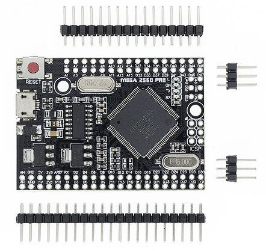
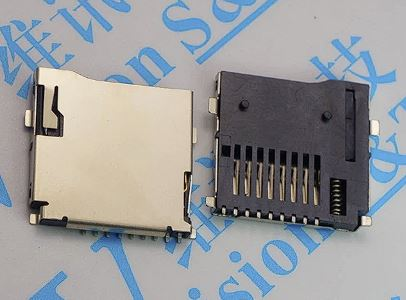
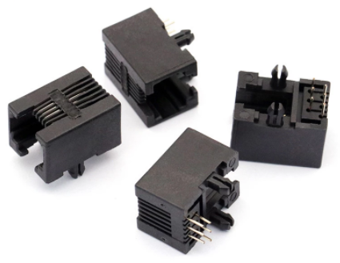
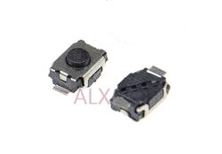
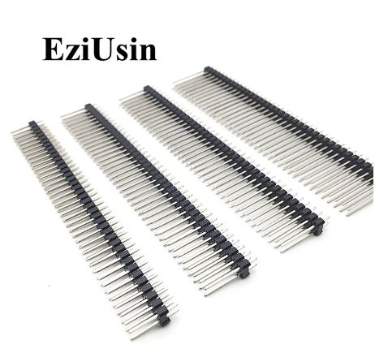
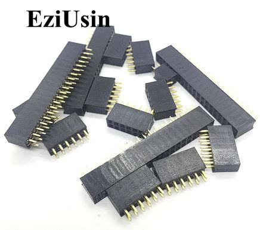

# Hardware Component Choices

[Interactive Bill of Materials (BOM)](ibom.html)

### Arduino

The Mega 2560 PRO Embed board is an unoffical "clone" of the Mega2560 that appears to orginally have been done by DFRobot, but is now available from all the usual Chinese vendors.   I got several [here](https://www.aliexpress.us/item/2251832723188280.html) for less than $10, and they have all worked fine.

 

### OLED

Any old 0.91" I2C (or IIC) OLED with the SSD1306 controller will do.  Many have the four pin header soldered on crooked so be prepared to fix that. :(

### Micro SD Card Connector

Push-push style with the two plastic locating pins on the front. My roll of 50 came from [here](https://www.aliexpress.us/item/2251832614001800.html).

### RJ12 Connector

The "longer" type RJ12 connector from [Aliexpress](https://www.aliexpress.com/item/32865986654.html) work fine if you don't want to spring for the official [Amphenol](https://www.digikey.com/en/products/detail/amphenol-icc-fci/54601-906WPLF/4242891) version.  Remember, ADAMnet takes a RJ12 reverse cable, I get mine at [Monoprice](https://www.monoprice.com/product?p_id=939)

### Switches

3x4x2mm SMD tact switches. Mine can from [here](https://www.aliexpress.us/item/2251832668857119.html).

### Bulk Capacitors

C3 is a bulk storage capacitor for the 5V rail.  It is optional since the Arduino already has caps on-board, but if you have a marginal ADAMnet 5V line or experience other power issues, they could help stabilize the overall board.  Any value between 10uf to 68uf is fine.

C2 is a tantalum (yes, evil, I know) to handle SD card inrush current if you hot swap the card.  Again, optional if don't plan on switching cards without powering down first.

### Resistors

R3 controls the activity LED brightness. 330R or higher will be fine. A good calculator is at:

[http://ledcalc.com/](http://ledcalc.com/)

### Arduino Pin Headers

To accomodate the RJ12 connector in the sandwhich board confirguration, I had to use higher than normal pin headers.  Since this is meant to the be a "cheap" build, I used the common [8.5mm high double row 2.5mm pitch female headers](https://www.aliexpress.us/item/2251832703602124.html), with [15mm high double row 2.5mm pitch male headers](https://www.aliexpress.us/item/2251832707632877.html) that are also readily availble on AliExpress with 3D printed 3.6mm spacers . I bought the 40 pin versions and just cut them down to the various sizes I needed since it was the cheapest optinon. :)

 

